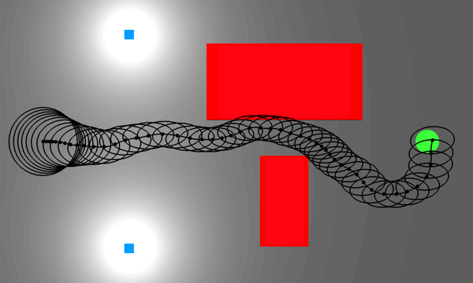
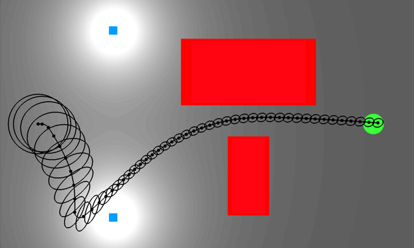

Outline
=======


*   **Belief Space**
    -   Modelling choices
    -   Planning in belief space: RRT & POMDP solvers
*   **Distance Functions** in belief space 
    -   L1
    -   KL Divergence
    -   Hausdorff
    -   Earth Movers Distance (EMD)
*   **Analysis** 
    -   Results
    -   Comparison with I-space representation
    -   Discussion of advantages & disadvantages


Introduction to Belief Space Planning
=====================================

> * A *belief* is a probability distribution over the state space
> * *Belief space* is a space of all such beliefs
> * How big is the belief space?

Belief Space Planning 
=====================

**Plan:** a mapping from beliefs to best actions that
takes agent from start states (set of beliefs) to goal states (set of
beliefs)
    
If you plan in the space of beliefs, you can reduce the variance of your belief
by:

- choosing actions which decrease uncertainty
- going to areas where sensors have high expected information gain

Belief Space Example: Information Gathering
===========================================

\centering

{width=6cm}\

{width=6cm}\

[^3]

[^3]: Computational Robotics group (Ron Alterovitz), UNC Chapel Hill


Common Assumptions / Modeling Choices
=====================================

-   High dimensionality $\to$ sampling
-   Need efficient update of state estimation $p(x|u,y)$
    - Most choose Gaussian distribution for beliefs; can use Kalman filter for
        belief updates

- Inputs to planner:
    -  dynamics model (stochastic noise from known distribution)
    -  sensor model (stochastic noise from known distribution)
    -  bounds on collision probability
    -  confidence in goal state


Another Example
===============

![Given a region with available localization, the robot can plan to reduce variance by entering the measurement area [^1]](./figures/information-gathering.png)

[^1]: [@bry2011rapidly], Bry & Roy ICRA 2011

Open-loop planning in belief space
===================

Paper terminology: **NOMDP** (Non-Observable Markov Decision Process)

**Non-Observable:** no sensor readings (open loop plan)

**Markov Decision Process:** next belief depends only on current belief and action
(this update function is given)

. . .

How to tame high dimensionality of belief space?

. . .

Random sampling!


RRT in Belief Space
===================


```python
G = {V -> {b_0}, E -> 0}

for N iterations do
    # choose belief in tree closest to random belief
    b_selected = SelectNode(B, V, d_n)
```
. . .
```python
    # apply a random control for a random time
    b_new = Random_Prop(b_select, U, Tmax)
```
. . .
```python
    # optimize wrt cost function
    if NodeLocallyBest(b_new, S, d_s):
        V <- V U {b_new}
        E <- E U {b_select -> b_new}
        Prune_Tree(b_new, V, E, d_s)
```

POMDP Formulation
=================


Distance Functions for Sampling Planners
============================

\centering

What makes a good distance function in belief space?

. . .

1. How similar are the shapes of the belief distributions?
2. How far apart are the beliefs in the underlying state space?


L1 Distance
===========


\centering
$$D_{L1}(b, b') = \int_{x \in \mathbb{X}} | b(x) - b'(x) | dx$$


KL-Divergence
=============


\centering
$$D_{KL}(b, b') = \int_{x \in \mathbb{X}} b(x)(\ln b(x) - \ln b'(x)) dx$$

* Information theoretic distance between pdfs


Hausdorff Distance
==================


\centering

$$D_{H}(b, b') = \max\Big\{d_{H}(b,b'), d_{H}(b', b)\Big\}$$
$$d_{H}(b, b') = \max_{x \in support(b)}\bigg\{ \min_{x' \in support(b')} \{ d_{\mathbb{X}}(x, x') \}\bigg\}$$

* $d_{\mathbb{X}}$ is the state space distance
* Does not take into account the distribution of states


Earth Mover's Distance (EMD)
============================

\centering


\begin{align}
  & D_{w}(b, b') = \inf_{f} \bigg\{ \int_{x \in \mathbb{X}} \int_{x \in \mathbb{X}} 
    d_{\mathbb{X}} (x, x') f(x,x')\partial x \partial x'  \bigg |  \nonumber \\
  & b = \int_{x'} f(x,x') \partial x', b'(x') = \int_{x}f(x,x')\partial x\bigg\} \nonumber
\end{align}

* $d_{\mathbb{X}}$ is the state space distance


Distance Function Demo
======================


Spaces in Belief Space Planning
===============================

* P Space: Same as in deterministic case
* Y Space: Same as Probabilistic case
* I Space: $\mathbb{P}$ (the space of all distributions over P)


Simplification to Non-Deterministic
===================================
* P Space: Same as in Deterministic case
* Y Space: Same as Deterministic case
* I Space: $Pow(P)$

\em{You cannot simulate Non-Deterministic case with Uniform distributions when dealing with distance functions}


Updating Beliefs
================

Need to perform Bayes' update efficiently:

\begin{align*}
p(s_t | u_{1:t}, y_{1:t}) &= \frac{1}{Z} p(y_t | s_t) \int_S p(s_t | u_t,
s_{t-1}) p(s_{t-1}) ds_{t-1} \\
X_t (\eta_t) &= h^{-1}(y_t) \cap X_{t}(\eta_{t-1}, u_{t-1}) 
\end{align*}

But in certain robotic tasks (eg: grasping), Gaussians are not necessarily a natural
representation, and can lead to "arbitrarily poor belief state estimates"[^2]

[^2]: Platt, Kaelbling, Lozano-Perez, Tedrake ICRA 2012 \cite{platt2012non}

Belief Space - Hard Modeling Choices
=============

* Hard to find steering functions: given two beliefs, what control inputs go
  from one to the other?
* No longer have space filling properties
* Reachability expensive to consider in planning
* Often assumes collisions are undesirable (how to model gaussian belief while
  in contact?)


References
==========

\tiny

